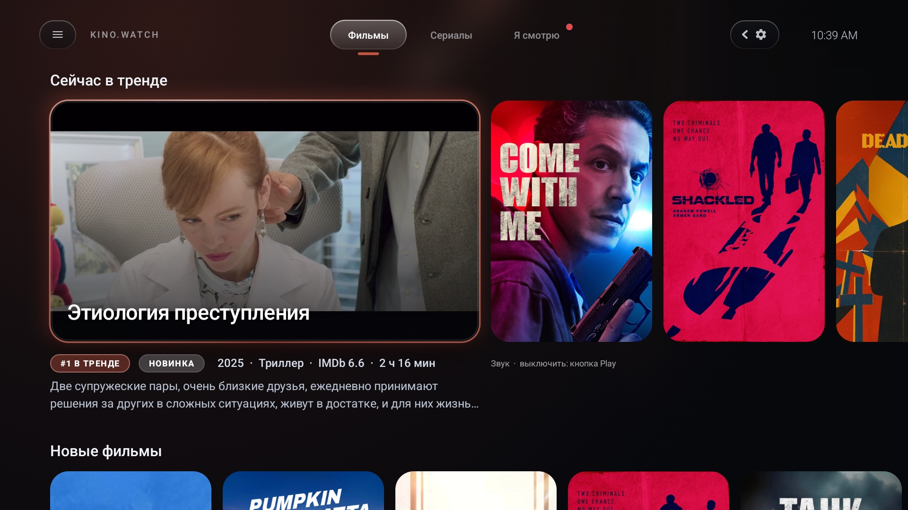
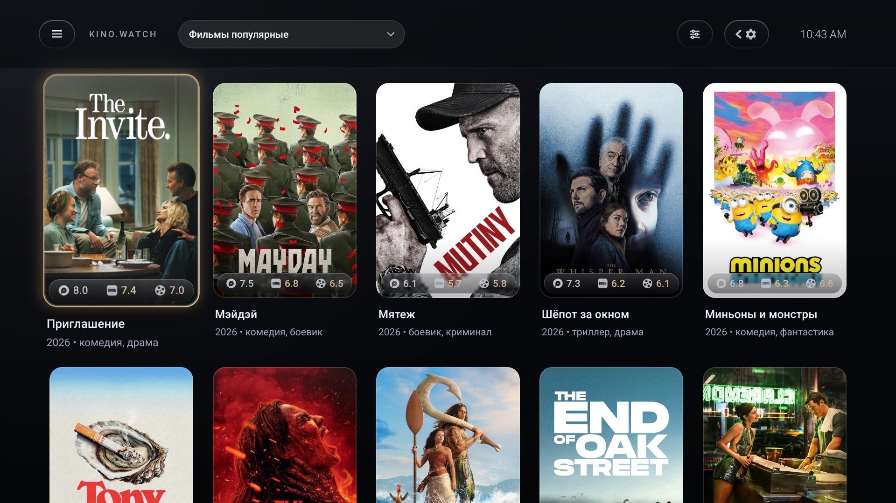
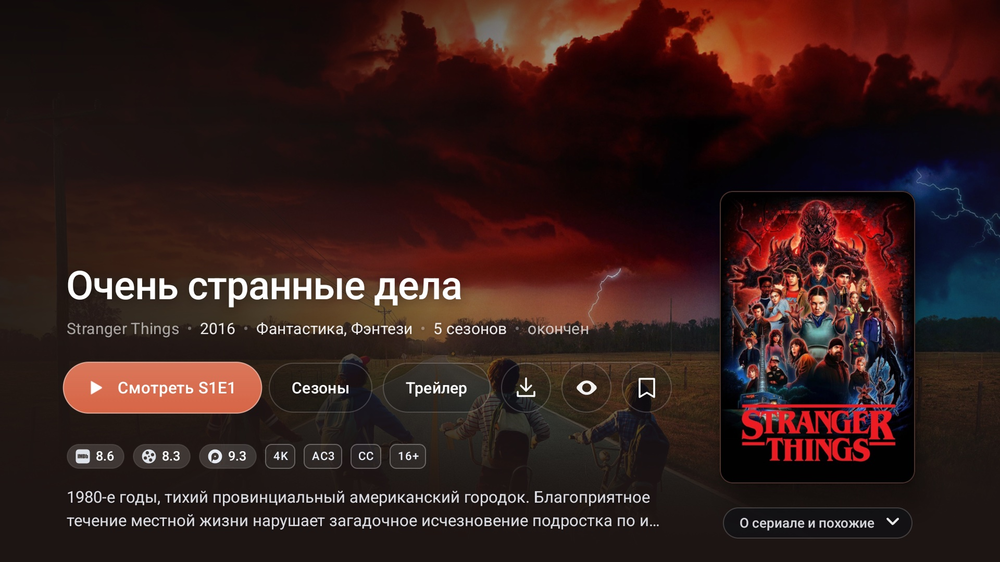
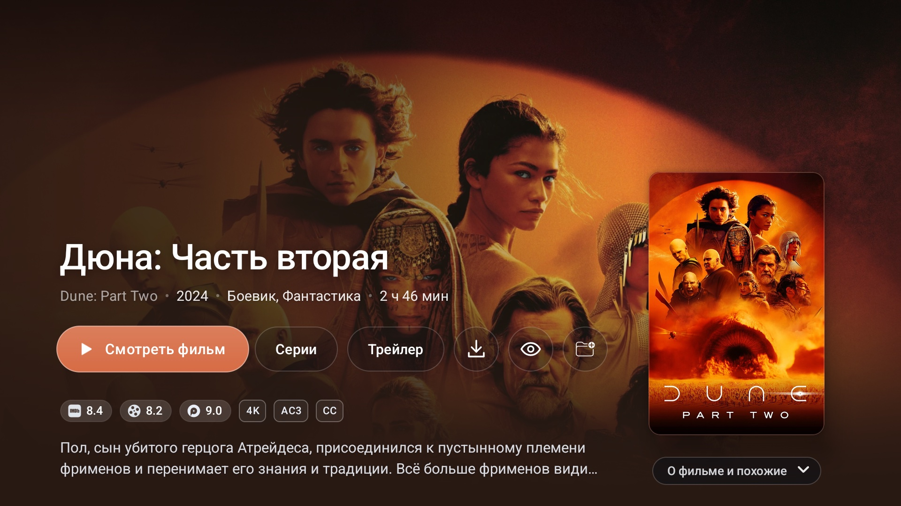
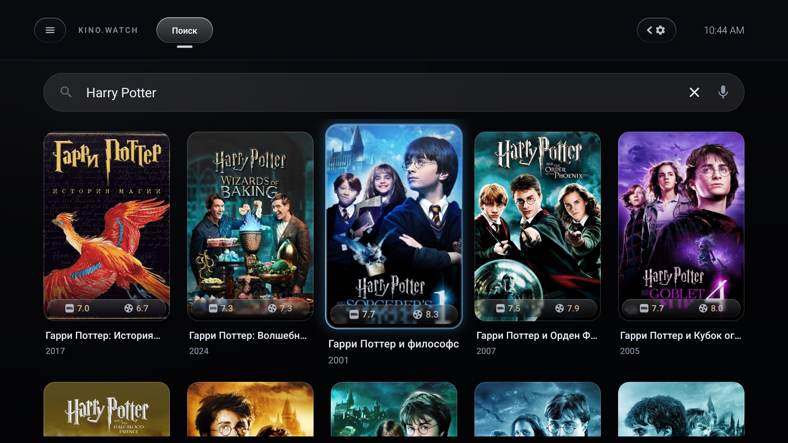

  

<h1 align="center">KinoWatch 2.07.24-Mod</h1>

Клиент kino.pub для Android TV на основе kino.watch 2.07

  
  
  
  
  

  <a href="#скриншоты">Скриншоты</a> ·
  <a href="#что-добавлено-по-сравнению-с-оригиналом-207">Что добавлено</a> ·
  <a href="#установка">Установка</a>

Неофициальный репозиторий приложения KinoWatch ([kino.watch](https://kino.watch)). Приложение
разрабатывают два человека, в основе лежит kino.watch версии 2.07. Текущая сборка называется
2.07.24-Mod.

KinoWatch - клиент видеосервиса kino.pub для телевизоров и приставок на Android TV. В нём есть
каталог фильмов и сериалов, поиск, закладки, история, загрузки и плеер с качеством до 4K.
Приложение рассчитано на управление с пульта, на телефоне и планшете оно тоже работает.

## Скриншоты

  
   
  <em>Главная: стеклянная шапка с вкладками, у выбранного фильма играет трейлер</em>

  
   
  <em>Каталог: рейтинги KinoPub, IMDb и КиноПоиск на полоске внизу обложки, под постером название, год и жанры</em>

  
   
  <em>Страница сериала «Очень странные дела»: фоновый кадр переходит в цвет постера, кнопки стеклянные</em>

  
   
  <em>Страница фильма «Дюна: Часть вторая»</em>

  
   
  <em>Поиск: ищет по названию, а также по имени актёра или режиссёра</em>

## Что добавлено по сравнению с оригиналом 2.07

Главное:

- Новый стартовый экран «Главная»: вкладки «Фильмы» и «Сериалы» с полками, у выбранного фильма
  сам запускается трейлер.
- Все экраны оформлены как главная: одни цвета, одна шапка, одно окно для вопросов приложения.
- Любую вкладку можно закрепить в шапке, тогда она видна на всех экранах.
- Рейтинги KinoPub, IMDb и КиноПоиск стоят прямо на обложке постера.
- Поиск находит фильмы по имени актёра или режиссёра, имя можно вводить и латиницей.
- Мод сам предлагает свою новую версию, а после обновления показывает список изменений.
- Главная и каталог на приставке Xiaomi листаются без рывков.
- Автовыбор качества включает 4K через 1-2 с после старта, а раньше на это уходило 20-60 с.
- Дальняя перемотка занимает 0.5-1.0 с вместо 4.9 с.
- Первый запрос каталога занимает 384 мс вместо 1981.
- Сообщение об ошибке называет причину и код, а отчёт об ошибке сохраняется в файл.

Цифры взяты из наших замеров.
Полный список изменений раскрывается по разделам.

Изменения последней сборки описаны в релизе
[v2.5.0](https://github.com/nlarionov/kino-watch-mod/releases/tag/v2.5.0).

<b>Интерфейс</b>: стеклянное оформление, шапка и закреплённые вкладки, постеры с рейтингами, страница фильма, боковое меню, тест скорости

- Новое стеклянное оформление: сквозь боковое меню и верхнюю панель виден размытый экран. В том
  же стиле сделаны кнопки, выпадающие списки и экран настроек.
- Все экраны оформлены как главная: каталог, поиск, «Я смотрю», закладки, история, загрузки,
  подборки, фильтры, настройки и окна. Цвета одни и те же, без синих оттенков, кнопки в форме
  «таблеток». Все вопросы приложения открываются в одном тёмном окне, серого системного окна
  больше нет.
- На телевизорах с Android 9 и новее меню «Открыть с помощью…», выбор сервера и списки в
  настройках тоже тёмные. Экраны «Загрузки», «Сезоны» и «Эпизоды» получили тёмный фон.
- На телевизоре у всех экранов одна шапка, как на главной: слева ☰ и KINO.WATCH, справа
  закреплённые вкладки, ⚙ и часы. Кнопка открытого экрана подсвечена. Кнопки «Назад» в шапке
  нет, назад ведёт кнопка пульта. Со всех сеток стрелка вверх ведёт в шапку.
- Выбранная вкладка стоит на светлой стеклянной капсуле, и капсула плавно перетекает на новую
  вкладку. Настройка «Стиль шапки» возвращает прежнюю плоскую шапку («Классика»).
- Любую вкладку можно закрепить: она стоит значком справа в шапке и видна на всех экранах.
  Закрепляют булавкой во «Вкладках стартового экрана» или долгим OK на вкладке.
- По умолчанию шапка компактная: закреплённые вкладки спрятаны за «‹ ⚙» и выезжают, когда фокус
  стоит на ⚙ или на одной из них. OK на ⚙ открывает настройки. «Кнопки шапки» → «Все видны»
  показывает все кнопки сразу.
- Красная точка новых серий у «Я смотрю» видна в шапке любого экрана.
- Выделенный постер или кнопка увеличивается, приподнимается и получает светлую рамку, по
  картинке пробегает блик.
- Рейтинги KinoPub, IMDb и КиноПоиск стоят на матовой стеклянной полоске внизу обложки. Рейтинг
  KinoPub показан, если за фильм проголосовали хотя бы 10 человек. Под постером название, год и
  жанры. Если строка не помещается, первым убирается год. Длинное название выбранного постера
  прокручивается.
- Страница фильма и сериала: фоновый кадр плавно переходит в цвет постера, кнопки стеклянные.
  Если кнопкам не хватает места, их текст уменьшается или они переходят на вторую строку. На
  телевизоре кнопки «Назад» на экране нет, назад ведёт кнопка пульта.
- Рейтинг KinoPub на странице фильма показан по 10-балльной шкале, как на сайте. У фильма с
  несколькими версиями показана длительность одной версии, а не их сумма.
- На странице фильма под «Похожие» стоят карточки подборок, в которые входит фильм. Карточка
  открывает подборку. «Похожие» и «Подборки» того же размера, что постеры в каталоге, и с той
  же полоской рейтингов.
- На картинке каждой серии в углу стоит её лучшее качество: 4K, FHD, HD или SD. Так видно,
  перезалил ли kino.pub серию в лучшем качестве.
- Кнопка начатой серии называется «Продолжить S2E3», новой серии «Смотреть S2E3». Так же и
  на странице, открытой по ссылке: из каналов главного экрана или из поиска Android TV.
- Трейлер на странице фильма не записывается как просмотр фильма.
- После «Отметить как непросмотренное» фильм или серия начинаются с начала.
- При запуске сразу чёрный экран и анимация, синего экрана с логотипом перед ней нет.
- Режиссёр и актёры на странице фильма показаны карточками с фото и ролью, если задан ключ
  Kinopoisk API (см. «Настройки»). «Показать всех» раскрывает полный список актёров.
- В адаптивном цвете выделения постеры и кнопки окрашиваются по картинке, меню остаётся белым.
- Внизу бокового меню стоит профиль: аватар, имя и срок подписки («Подписка до 28 декабря», в
  последнюю неделю «Осталось 3 дня»). OK на профиле открывает выбор аватара.
- В боковом меню у «Я смотрю» стоит число новых серий, на главной у вкладки «Я смотрю» горит
  красная точка.
- ☰ в шапке открывает боковое меню прямо на текущем экране. На экранах «Я смотрю», «Закладки»,
  «История», «Загрузки» и «Подборки» стрелка влево из первого столбца ведёт к ☰. В каталоге
  стрелка влево открывает меню, как раньше.
- На экране теста скорости у каждого сервера своя кнопка, а сам экран открывается на «Замерить
  оба сервера». Замер идёт 6 секунд, цифра растёт на глазах. Строка без замера показывает
  результат фонового замера и его возраст. Замер больше не пишет 100 МБ во флеш-память
  приставки.
- Выключено анимированное свечение вокруг выделенного элемента. Оно рисовалось одну секунду из
  шести, а перерисовывало экран 60 раз в секунду все шесть секунд.
- Главная и каталог на приставке Xiaomi листаются без рывков. На главной медленных кадров
  0.8-1.6 % вместо 32-36 %, в каталоге 1.6-2.3 % вместо 18-20 %. Размытые слои фона главной
  больше не перерисовываются на каждом кадре, а заливки под постером в сетке рисуются только там,
  где их видно.
- После «Настройки» и «Назад» боковое меню открывается сверху, если текущий раздел виден на
  первом экране меню.
- Исправлены 9 русских слов, набранных с латинскими буквами-двойниками, например «Скорость» и
  «Серия».

<b>Стартовый экран</b>: вкладки, переключатели, полки, трейлеры, «Продолжить просмотр»

- Появился экран «Главная». При первом запуске на телевизоре мод открывается на нём. Настройка
  «Стартовый экран» возвращает «Библиотеку», «Я смотрю» или «Закладки».
- Вверху стоят вкладки «Фильмы» и «Сериалы». «Я смотрю», «Закладки», «История», «Поиск» и
  «Каталог» в новой установке закреплены справа в шапке. Вкладки «Мультфильмы», «Аниме», «ТВ
  шоу», «Концерты», «4K», «Документальные», «Подборки» и «Спорт-ТВ» включаются в настройке
  «Вкладки стартового экрана», там же меняется порядок вкладок.
- Долгий OK на вкладке: стрелки влево и вправо переставляют её, вверх и вниз закрепляют и
  открепляют.
- На вкладке «Мультфильмы» есть переключатель «Мультфильмы | Мультсериалы», выбор запоминается.
  На вкладках «Аниме», «Документальные» и «4K» есть переключатель «Фильмы | Сериалы», «Аниме»
  открывается на сериалах.
- Вкладка «Аниме» показывает аниме, даже если включено «Отключение аниме».
- Каждая вкладка собрана из одинаковых полок: «Сейчас в тренде», новые и популярные. На
  вкладках «Фильмы» и «Сериалы» есть ещё «Продолжить просмотр». Полки 4K и лучшие по оценкам
  KINO.WATCH, IMDb и КиноПоиска включаются в «Разделах и порядке».
- Полка «Сейчас в тренде» показывает фильмы крупно. У выбранного фильма сам запускается
  трейлер со звуком, кнопка Play на пульте включает и выключает звук. С выключенной настройкой
  «Автоматические трейлеры» видна только обложка.
- Последняя карточка полки, «Смотреть все», открывает тот же список в каталоге. У «Продолжить
  просмотр» эта карточка называется «Все» и открывает «Я смотрю» на фильмах или на сериалах,
  смотря на какой вкладке стоит полка.
- Карточка в «Продолжить просмотр» сразу запускает видео с места остановки, сериал с нужной
  серии. На карточке написано, сколько осталось или какая серия следующая.
- В «Продолжить просмотр» попадает начатый сериал, даже без подписки. Подписка нужна только для
  новых серий. Порядок сериалов берётся из истории просмотров, поэтому впереди те, что смотрели
  недавно.
- Сериал или фильм, который пересматривают, тоже попадает в «Продолжить просмотр». После
  досмотренной серии ряд предлагает следующую, недосмотренную продолжает с места остановки.
- В «Продолжить просмотр» нет фильмов, досмотренных до титров, фильмов, которые только открыли,
  и сериалов, целиком отмеченных просмотренными. Ряд появляется, только когда в нём что-то есть.
- Что показывать в «Продолжить просмотр» на вкладках «Фильмы» и «Сериалы», выбирается в
  настройках: только фильмы или сериалы этой вкладки, или всё вместе.
- Если kino.pub временно отказал («слишком много запросов»), «Продолжить просмотр» не пропадает
  и не сжимается, а пробует ещё раз. При возврате на главную ряд не запрашивается заново целиком.
- «Убрать» в быстрых действиях «Продолжить просмотр» скрывает тайтл только на этом устройстве,
  отметки просмотра не меняются. Тайтл вернётся в ряд, когда его начнут смотреть снова. На
  экране «Я смотрю» есть отдельный пункт «Убрать из «Я смотрю»», он выключает подписку.
- «Начать сначала» в быстрых действиях запускает фильм или серию с начала.
- Набор и порядок полок меняются в настройке «Разделы и порядок».
- На телефоне у главной своя раскладка для сенсорного экрана.
- Чтобы выйти с главной, «Назад» нужно нажать дважды.

<b>Каталог и поиск</b>: одинаковые списки во всех разделах, «Аниме» в меню, поиск по актёрам

- В каждом разделе каталога одни и те же списки, если они есть на kino.pub: все, новинки,
  популярные, в тренде, 4K, лучшие KINO.WATCH, лучшие IMDb и лучшие КиноПоиск. «Горячие» теперь
  называются «В тренде», как на главной.
- В «Мультфильмах», «Аниме» и «4K» сначала идут все списки фильмов, потом все списки сериалов.
  Для мультсериалов есть свои списки.
- В боковом меню есть раздел «Аниме».
- Поиск находит фильмы актёров и режиссёров, имя можно вводить и латиницей: «Tom Hardy»,
  «Nolan». Если запрос похож на имя, фильмы этого человека стоят первыми. Имена, которые
  kino.pub пишет иначе («Киану Ривз»), латиницей не находятся.
- Поиск не показывает ошибку на каждую букву: запрос, который отменила следующая буква, ошибкой
  не считается.

<b>Плеер и качество</b>: автовыбор качества, старт видео, перемотка, буфер

- Автовыбор качества (Auto) переписан. Он стартует с самой высокой дорожки, которая успеет
  загрузиться, и включает 4K через 1-2 с после старта, а не через 20-60 с.
- Старт видео с середины 10-секундного куска занимает 1.6-1.8 с вместо 8.2 с.
- Дальняя перемотка занимает 0.5-1.0 с вместо 4.9 с.
- Перемотка внутри уже загруженного видео встаёт на ближайший ключевой кадр, если он не дальше
  4 с от выбранной точки. Картинка появляется сразу, без ожидания декодера. В остальных случаях
  перемотка точная, как раньше.
- Перемотка больше не сбрасывает качество на 4K и не сбрасывает оценку скорости.
- Плеер держит 60 с видео позади, в 4K 30 с, поэтому короткая перемотка назад не качает кусок
  заново.
- Видео стартует после 1 с буфера вместо 10 с, а после остановки на подгрузку продолжает через
  2 с вместо 5 с.
- Если в меню качества выбрать то качество, которое уже играет, картинка больше не замирает на
  1.2-2.2 с. Кнопки «ОК» в меню нет: качество меняется сразу при выборе.
- Пока видео не играет, приложение раз в 10 минут 5 секунд меряет скорость до сервера, с
  которого шло последнее видео. Первое решение Auto опирается на эту цифру. Во время просмотра
  замер не идёт.
- Уведомление про 4K не появляется на телевизоре без 4K. На телевизоре с 4K его кнопка
  открывает настройки, где 4K включается.
- В меню «Субтитры» отмечен пункт «Выключить», когда субтитры выключены.
- Верхняя панель плеера на телевизоре компактная: название и «Видео / Аудио / Субтитры» слева,
  статистика справа на той же высоте. Кнопки «Назад» и тёмной полосы больше нет.
- TalkBack называет кнопки скорости и масштаба своими именами, а не «Следующий трек».

<b>Сеть и загрузка</b>: ранние запросы, кэш каталога, предзагрузка, тайм-ауты и DNS

- Первые запросы уходят ещё во время заставки: приложение повторяет запросы прошлого запуска и
  отдаёт ответы экрану. Список на экране после холодного старта появляется за 1723 мс вместо
  1994.
- Первый запрос каталога занимает 384 мс вместо 1981.
- Списки каталога держатся в памяти 3 минуты. Возврат в раздел занимает 18-28 мс вместо 123-192
  и не делает запросов.
- После старта приложение в фоне загружает первую страницу до 4 разделов, которые вы открывали
  недавно. Такой раздел открывается без запроса.
- Сетка подгружает страницы на 2 ряда ниже последнего видимого, а не на 40 постеров вперёд.
- Постеры следующих рядов загружаются заранее, и сетка берёт их из памяти, а не декодирует
  второй раз. На эмуляторе из памяти пришли 20 постеров из 25, раньше ни одного. Заранее
  загруженные постеры больше не выгружаются до того, как сетка их покажет.
- Одна и та же страница больше не запрашивается дважды: за холодный старт 4 запроса вместо 7.
- Клиент API собирается в фоне, а не в главном потоке до первого кадра.
- Если сервер принял соединение и молчит, ошибка в каталоге появляется через 32 с вместо 142 с,
  на главной тоже через 32 с.
- Если DNS перестал отвечать, ошибка появляется примерно через 11 с, а раньше спиннер крутился
  около 100 с. Каждый DNS-запрос ограничен 4 с, а после двух хостов без ответа следующие 15 с
  запросы сразу получают ошибку.
- Когда сеть и DNS вернулись, окно ошибки в каталоге и в «Я смотрю» само нажимает «Повторить».
- Индикатор загрузки появляется, только если ответа нет дольше секунды. Раньше он мигал при
  каждом открытии.

<b>Настройки</b>: два раздела интерфейса, вкладки, полки, шапка, размер интерфейса, трейлеры, фото актёров, аватар, загрузки, каналы

- Настройки интерфейса разделены на два раздела. «Стартовый экран»: вкладки, полки,
  «Продолжить просмотр», трейлеры, меню. «Внешний вид»: размер интерфейса, стиль и кнопки шапки,
  постеры, цвет выделения. BACK сначала закрывает открытый раздел, второй BACK выходит из
  настроек.
- «Стартовый экран»: добавлен вариант «Новый стартовый экран».
- «Вкладки стартового экрана»: какие вкладки показывать в шапке главной, в каком порядке и
  какие закрепить (булавка в строке вкладки).
- «Разделы и порядок»: какие полки показывать на вкладках главной и в каком порядке. С пульта
  выберите ☰ у полки, нажмите OK и двигайте её стрелками вверх и вниз. Порядок по умолчанию
  можно восстановить.
- «Элементов в строке»: 10 или 20 фильмов и сериалов в каждой полке главной.
- «Размер интерфейса»: «Компактный», «Стандартный» или «Крупный». Меняет шрифт, кнопки и
  постеры на всех экранах телевизора, по умолчанию стоит «Стандартный».
- «Стиль шапки»: «Стекло» (по умолчанию) или «Классика», плоская шапка как раньше.
- «Кнопки шапки»: «Компактно» (по умолчанию, закреплённые вкладки спрятаны за «‹ ⚙») или «Все
  видны».
- «Продолжить просмотр: страница «Фильмы»» и «…«Сериалы»»: «Только фильмы» или «Фильмы и
  сериалы», и так же для сериалов.
- «Отключение индийского контента» и «Отключение российского контента» (вместе с СССР) скрывают
  фильм или сериал, если среди стран производства есть эта страна. Работают на главной и в
  каталоге, «Продолжить просмотр» не скрывают. По умолчанию выключены. «Отключение аниме» теперь
  тоже флажок.
- «Автоматические трейлеры» включают и выключают трейлеры на главной. Выключите их, чтобы
  экономить трафик.
- «Фото актёров и режиссёров»: сюда вводится личный ключ Kinopoisk API Unofficial
  (kinopoiskapiunofficial.tech), приложение сразу его проверяет. Ключ хранится только на
  устройстве, в зашифрованном виде, и не попадает в логи. Фото и роли кэшируются на неделю.
- «Постеры в строке»: 5 крупных или 6 компактных.
- «Цвет выделения»: адаптивный или один из 10 цветов.
- «Аватар»: 49 готовых картинок в 8 группах, своя картинка JPEG или PNG до 5 МБ из памяти
  приставки или с USB, или картинка аккаунта (Gravatar).
- «Куда скачивать»: память приставки или подключённый USB-диск. При смене диска уже скачанное
  переносится, на экране виден процент. Тот же выбор открывается из «Загрузок».
- «Каналы» открывают окно с тремя переключателями каналов главного экрана Android TV: «Я
  смотрю», «Новые фильмы», «Сериалы». Каналы работают на Android TV 8.0 и новее.

<b>Обновления</b>: новая версия мода из приложения, список изменений

- Раз в сутки приложение проверяет, вышла ли новая версия мода, и предлагает её скачать и
  поставить. Проверку можно запустить и вручную: «Настройки», «О приложении», «Проверить новую
  версию». Оригинал спрашивал сайт kino.watch и мог предложить не ту сборку.
- Версия берётся из Releases публичной репы на GitHub. Запрос уходит без токена kino.pub и без
  данных устройства. Предлагается только версия новее установленной.
- Файл скачивается во внутреннюю память приложения, доступ ко всем файлам для этого не нужен.
- При первом обновлении Android может попросить разрешить приложению установку приложений.
  После этого откройте приложение и проверьте обновление ещё раз.
- После обновления один раз показывается список изменений всех версий, вышедших после
  установленной. В настройках «О приложении» → «Лог изменений приложения» показывает все версии
  с v2.2.0.
- «О приложении» → «Версия» показывает номер выпуска, например «v2.5.0 (2.07.24-Mod, сборка
  187)». Тот же номер есть в отчёте о сбое.

<b>Отчёты об ошибках</b>: коды ошибок, «Отправить лог», отчёт после падения

- Сообщение об ошибке называет причину и код: `NET-OFF`, `DNS`, `TIMEOUT`, `CONNECT`, `SSL`,
  `BLOCKED`, `DATA` или `HTTP` с номером. Оригинал почти на всё писал «Oшибка соединения с
  сервером!», причём с латинской O.
- Ошибка защищённого соединения показывает дату и время устройства, чтобы были видны сбитые
  часы.
- Если вместо сервера kino.pub ответил провайдер, сообщение говорит, что адрес заблокирован, а
  приложение пробует другие адреса.
- В окне ошибки списка кнопка «Открыть меню» заменила кнопку, которая закрывала приложение. Без
  сети остаются доступны «Загрузки» и настройки.
- «Отправить лог» в настройках сохраняет отчёт в `Download/kino-watch/` и открывает окно
  «Поделиться». В отчёте версия приложения, устройство, версия Android, недавний лог приложения
  и список открытых экранов. Токены входа и имя аккаунта вырезаются до записи.
- После падения приложение сохраняет отчёт со стеком ошибки и при следующем открытии каталога
  один раз предлагает его отправить.
- Отчёт сам никуда не уходит: куда его отправить, решает пользователь.

## Установка

Последняя сборка: **v2.5.0** (2.07.24-Mod), 4 октября 2026.

- Файл: https://github.com/nlarionov/kino-watch-mod/releases/latest/download/kino-watch-mod.apk
- На телевизоре: откройте Downloader и введите код **4159634**. Код всегда ведёт на самую свежую
  сборку, запоминать новый код не нужно.

Нужна действующая подписка kino.pub. Мод ничего не обходит и ничего не открывает бесплатно.

- Пакет мода называется `watch.kino.mod`, поэтому он ставится рядом с официальным kino.watch и
  не заменяет его.
- Вход у мода свой: после установки один раз введите код устройства на kino.watch/device.
- Сборки v2.0.0 и v2.0.1 (2.07.22-Mod) из этого репозитория обновляются поверх, вход
  сохраняется.
- Прежние сборки мода 1.x (пакет `watch.kino`) эта версия не обновляет.
- Если 2.07.24-Mod уже стоит из другого источника, сначала удалите его: у той сборки другая
  подпись, и новая поверх неё не встанет.
- Следующие сборки из этого репозитория тоже ставятся поверх.
- Начиная с v2.2.1 новые версии мод предлагает сам. Если стоит v2.2.0, один раз поставьте
  последнюю сборку через Downloader: в v2.2.0 обновление из приложения закрывает его на части
  телевизоров.
